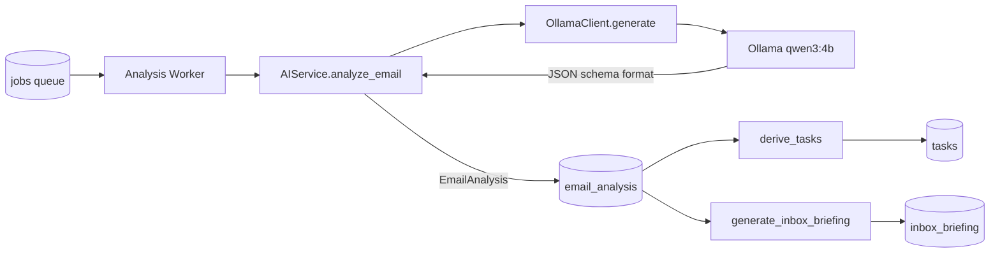

# AI Architecture

Alfred's intelligence layer is deliberately small and predictable: one local model, three structured prompts, deterministic post-processing.

## The pipeline

## Three AI surfaces

| Surface | Entry point | Structured? | Cached by |
|---|---|---|---|
| Per-email analysis | [[backend.app.ai.service.AIService.analyze_email]] | Yes — [[backend.app.schemas.EmailAnalysis|EmailAnalysis]] schema | content fingerprint + model + schema version |
| Reply draft | [[backend.app.ai.service.AIService.draft_reply]] | No (plain text) | — (on demand) |
| Daily briefing | [[backend.app.ai.service.AIService.generate_inbox_briefing]] | Yes — [[backend.app.schemas.InboxBriefing|InboxBriefing]] schema, counts recomputed locally | briefing fingerprint |

## Hard rules enforced in code

- **Structured output**: Ollama's `format` parameter receives the Pydantic JSON Schema (`[[Structured Output]]`); invalid output raises [[backend.app.ai.ollama_client.OllamaInvalidResponse]].
- **Counts are local**: `InboxBriefing` totals are recomputed from the eligible set, never trusted from the model ([[Briefing Generation Flow]]).
- **Eligibility before inference**: only active-inbox, policy-eligible mail is enqueued ([[backend.app.mail.eligibility.MailEligibilityPolicy|MailEligibilityPolicy]]); the worker re-checks eligibility at pickup time.
- **Lazy categories**: Promotions/Social are deferred unless Gmail IMPORTANT or user interaction ([[ADR-007 - Background Analysis Queue]]).
- **Prompt injection posture**: mail is treated as untrusted data; see [[Prompt Injection Defense]] and [[Email Content Trust Boundary]].

## Why qwen3:4b

Small enough for consumer hardware, supports structured output (`format`), good summarization per the golden corpus. See [[ADR-005 - qwen3 4b]] and [[AI Performance]].

## Related

- [[AI Overview]]
- [[AI Caching]]
- [[AI Failure Handling]]
- [[Email Analysis Flow]]
