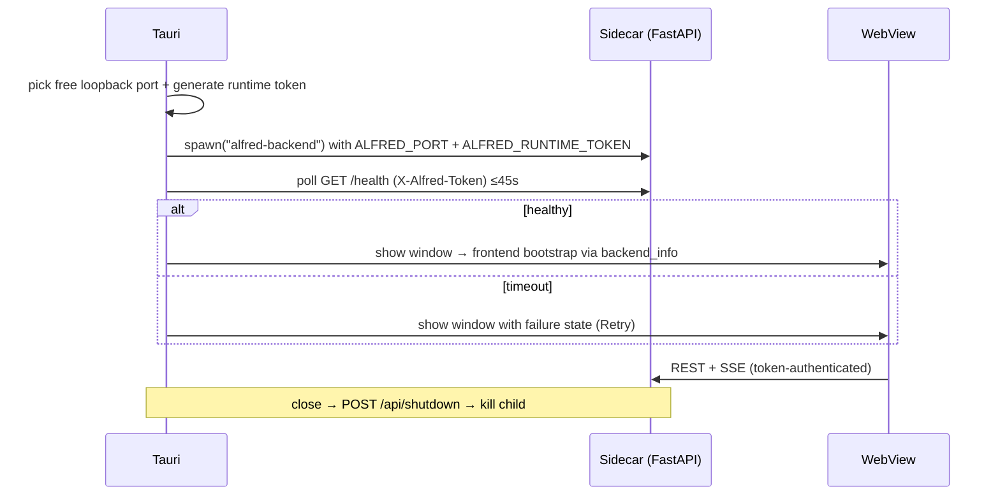

# Desktop Architecture

The desktop shell is a minimal Tauri 2 application whose entire job is: own the backend sidecar, gate the workspace on readiness, and enforce a single-instance product.

## Layout

- `desktop/src-tauri/src/main.rs` — the native lifecycle: sidecar spawn/own, readiness polling, window reveal, graceful shutdown, single-instance, and the two frontend-exposed commands (`backend_info`, `retry_backend`).
- `desktop/src-tauri/tauri.conf.json` — product config: dev URL, bundled `../../frontend/dist`, CSP (connect-src locked to loopback), window 1280×850 (hidden until the backend is healthy), NSIS `currentUser` bundle.
- `desktop/src-tauri/capabilities/default.json` — `core:default` only. The webview has NO shell/filesystem/process permissions; the sidecar is spawned from Rust, unreachable from React.
- `desktop/src-tauri/icons/` — generated placeholder mark (violet gradient "A") pending the approved brand asset (`tools/generate_icons.py`).
- `desktop/src-tauri/binaries/alfred-backend` — the compiled sidecar; its release configuration is embedded inside the executable at build time ([[Sidecar Architecture]]).

## Runtime contract

## Verification status

- Native window, sidecar spawn, readiness, single-instance, graceful shutdown, and installed-app flows were exercised against the real AppData ([[Project Status]]).
- The NSIS bundle is **unsigned** — UNSIGNED DEVELOPMENT RELEASE ([[Windows Packaging]]).

## Related

- [[Tauri Overview]]
- [[Sidecar Architecture]]
- [[Windows Lifecycle]]
- [[Native Security]]
- [[ADR-015 - Desktop Session Authentication]]
- [[ADR-016 - Tauri-Owned Sidecar Lifecycle]]
