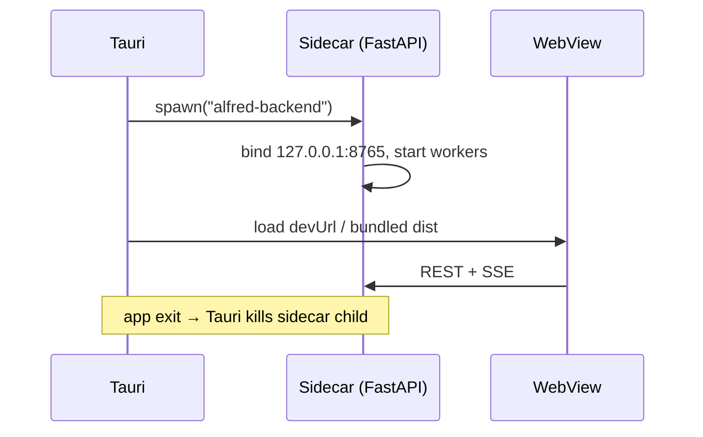

# Desktop Architecture

The desktop shell is a minimal Tauri 2 application whose entire job is: open a window, spawn the backend sidecar, serve the frontend.

## Layout

- `desktop/src-tauri/src/main.rs` — Tauri builder; registers the shell plugin; in `setup` it spawns the sidecar and keeps the child handle managed by Tauri (so it is killed when the app exits).
- `desktop/src-tauri/tauri.conf.json` — product config: dev URL `http://localhost:5173`, bundled frontend dist, CSP (`connect-src` restricted to the local backend), window 1280×850 min 900×650, NSIS target.
- `desktop/src-tauri/capabilities/default.json` — permissions: `core:default` + `shell:allow-spawn` (nothing else; no filesystem/network capabilities for the webview).
- `desktop/src-tauri/binaries/alfred-backend` — the compiled FastAPI sidecar (see [[Sidecar Architecture]]).

## Lifecycle

## Verification status

The shell and sidecar spawn are implemented; the sidecar binary has been built. The full NSIS packaging + native QA pass has **not** been completed in this repository's history — see [[Project Status]].

## Related

- [[Tauri Overview]]
- [[Windows Lifecycle]]
- [[Windows Packaging]]
- [[Native Security]]
