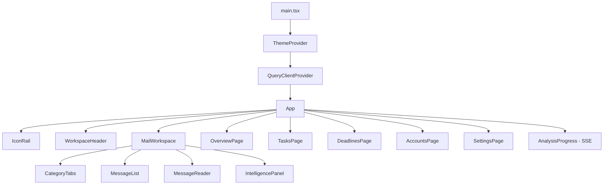

# Frontend Architecture

React 19 + TypeScript + Vite, TanStack Query for data, TanStack Virtual for the message list, lucide-react icons, and a token-driven CSS system. No CSS framework, no state library beyond Query.

## Composition

## Data layer

- All server data goes through TanStack Query (`[[frontend.src.api.emails]]`); queries are keyed by view scope/category/filter/search so switching tabs never refetches needlessly.
- Live progress arrives via **SSE** ([[SSE Progress Flow]]); [[frontend.src.components.ui.AnalysisProgress.AnalysisProgress|AnalysisProgress]] debounces query invalidation to avoid request storms.
- Backfill progress is **observed** (accounts query polling with `refetchInterval`), never driven by the UI — the backend owns that loop.

## Structure

| Area | Files |
|---|---|
| Shell | [[frontend.src.App]], [[frontend.src.layout.IconRail]], [[frontend.src.layout.WorkspaceHeader]] |
| Mail | [[frontend.src.mail.MailWorkspace]], [[frontend.src.mail.CategoryTabs]], [[frontend.src.mail.MessageList]], [[frontend.src.mail.MessageRow]], [[frontend.src.mail.MessageReader]] |
| Intelligence | [[frontend.src.intelligence.IntelligencePanel]] |
| Features | overview / tasks / deadlines / accounts / settings pages |
| Theme | [[frontend.src.theme.ThemeProvider]], [[frontend.src.theme.ThemeToggle]], [[frontend.src.theme.themeStore]] |
| API | [[frontend.src.api.client]], [[frontend.src.api.emails]] |
| Styles | `tokens.css`, `themes.css`, `motion.css`, `surfaces.css`, `globals.css`, `reset.css` |

## Design system in one line

Semantic tokens per theme (`data-theme` on `<html>`, set before first paint in `index.html`), motion budget 110–420ms with `prefers-reduced-motion` kill-switch, aurora ambient background behind a document-style reader — see [[Design System]].

## Virtualization

[[frontend.src.mail.MessageList.MessageList|MessageList]] uses `@tanstack/react-virtual` with dynamic row measurement — only visible rows render, category filtering is database-driven (server-side), so the client never holds the whole mailbox.

## Related

- [[Frontend Code Map]]
- [[Frontend Component Map]]
- [[Frontend Data Fetch Flow]]
