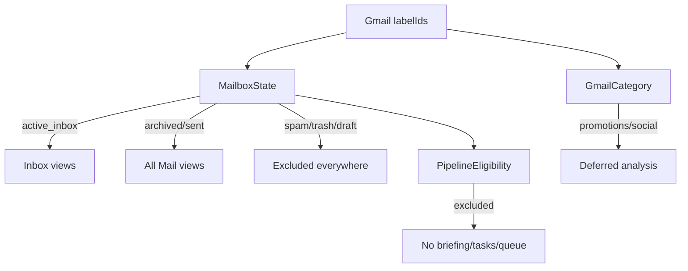

# Gmail Architecture

Gmail is the **source of truth** for mailbox state. Alfred consumes it read-only and mirrors only what the product needs locally.

## Client surface

Everything wire-level lives in [[backend.app.mail.providers.gmail.GmailProvider]]:

- OAuth: auth URL (PKCE), code exchange, refresh ([[Gmail OAuth Flow]]).
- Sync: initial INBOX page, `history.list` incremental sync, `messages.list` pagination, METADATA-only label refresh, All Mail backfill.
- Normalization: MIME/HTML → plain text ([[MIME Parsing]]), label IDs → mailbox model.

## The mailbox model

Gmail label IDs feed a three-layer local model ([[backend.app.mail.eligibility]]):

- `INBOX` + not spam/trash → active; no INBOX → archived; SENT-only → sent (visible in All Mail with badge, never attention).
- `includeSpamTrash=false` on every `messages.list` call — spam/trash never enter the local cache via sync; history-added spam is skipped; permanently-deleted mail is marked excluded, not deleted ([[Data Ownership]]).
- Categories come from Gmail's own `CATEGORY_*` labels — the LLM never re-classifies tabs.

## Sync strategy (two phases)

1. **Phase A — Inbox**: historyId incremental sync keeps the active inbox fresh (cheap, per-history-event).
2. **Phase B — All Mail backfill**: a durable backend job pages through `q=-label:INBOX` one bounded page at a time ([[All Mail Backfill Flow]], [[backend.app.main._backfill_worker]]).

## Token & credential handling

DPAPI-encrypted refresh/access tokens in [[credentials]]; transparent refresh via [[backend.app.mail.providers.gmail.GmailProvider._ensure_access_token]]. See [[Token Storage]] and [[DPAPI]].

## Related

- [[Gmail Overview]]
- [[History Sync]]
- [[Pagination]]
- [[Gmail Errors]]
