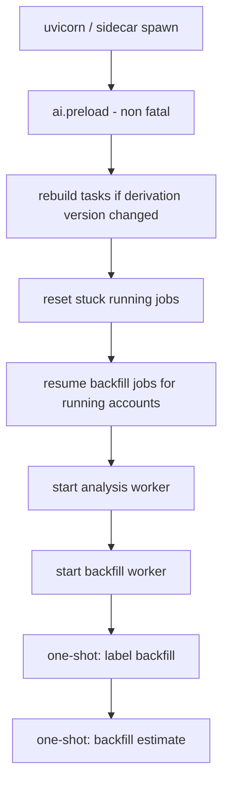

# Runtime Lifecycle

Everything that happens between process start and clean shutdown, and why nothing is lost in between.

## Backend startup ([[backend.app.main.lifespan]])

- Preload failure is ignored — first inference is just slower.
- Task rebuild uses [[backend.app.services.task_derivation.rebuild_tasks_from_analyses|rebuild_tasks_from_analyses]] (cheap, no LLM).
- Stuck `running` jobs → `queued`; retryable jobs reset ([[Background Analysis Job Flow]]).
- Backfill resume is driven by the typed `backfill_state` in the [[accounts]] sync cursor ([[All Mail Backfill Flow]]).

## Steady state

Two workers poll the [[jobs]] table (analysis priority 100→10; backfill priority 5, always below analysis). SSE broadcasts keep the UI fresh; SQLite WAL keeps readers unblocked.

## Backend shutdown

Cancel both workers + one-shot tasks → close SQLite. In-flight work is already durable: jobs are status-tracked rows, the sync/backfill cursors persist after every page.

## Desktop lifecycle

Tauri spawns the sidecar in `setup` and keeps the child handle managed — app exit kills the backend. See [[Windows Lifecycle]].

## Frontend lifecycle

Theme is applied before first paint (inline script in `index.html`). React Query hydrates page-by-page; SSE reconnects lazily (the progress component closes on unmount).

## Related

- [[Application Startup Flow]]
- [[Application Shutdown Flow]]
- [[Entry Points]]
- [[Critical Execution Paths]]
