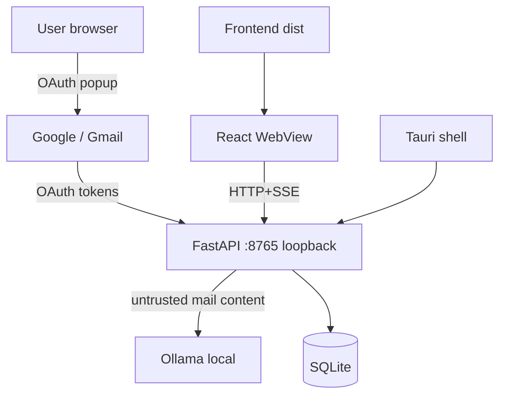

# Security Architecture

Alfred's security posture: **email content is untrusted**, tokens are DPAPI-protected, the local API is loopback-bound, and the desktop shell restricts the webview.

## Trust boundaries

1. **Google ↔ Alfred**: OAuth2 + PKCE; tokens DPAPI-encrypted at rest; only `gmail.readonly` + `userinfo.email` scopes.
2. **Email content ↔ Alfred**: treated as hostile input — HTML stripped server-side before storage ([[backend.app.mail.providers.gmail.GmailProvider._clean_html]]), bodies truncated before inference ([[Email Content Trust Boundary]]).
3. **Alfred ↔ Ollama**: loopback only; the model is instructed never to follow mail instructions ([[Prompt Injection Defense]]).
4. **Frontend ↔ backend**: CORS locked to `localhost:5173` / `tauri://localhost`; backend binds `127.0.0.1` only ([[Local API Security]]).
5. **Tauri shell**: CSP restricts connect-src to the local backend; only the `shell:allow-spawn` capability is granted ([[Native Security]]).

## What we explicitly do NOT claim

- No end-to-end encryption of the local database — at-rest protection of mail content is the OS user account.
- No sandboxing of the LLM beyond prompt rules — a compromised model could return garbage (schema validation catches structural failure, not hostile content). See [[Threat Model]].

## Related

- [[Threat Model]]
- [[Token Security]]
- [[OAuth Security]]
- [[Data Privacy]]
