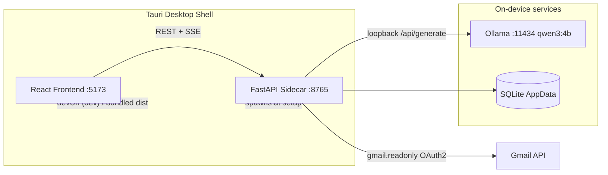
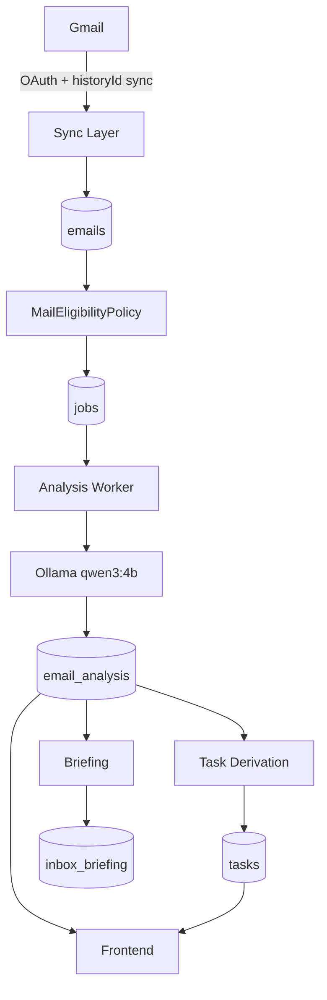

# System Architecture

Alfred is a three-process desktop system: a React frontend, a FastAPI backend (compiled to a native sidecar), and a local Ollama runtime — plus Gmail as the only external service.

## Process boundaries

| Process | Role | Port | Lifecycle |
|---|---|---|---|
| React + Vite frontend | All UI; React Query data layer; SSE consumer | 5173 (dev) | bundled into Tauri in production |
| FastAPI backend | OAuth, Gmail sync, AI orchestration, SQLite, SSE | 8765 | compiled sidecar, spawned by Tauri ([[Sidecar Architecture]]) |
| Ollama | Local LLM serving | 11434 | user-installed, external to Alfred |

## The core loop

Gmail state → local mirror ([[emails]]) → eligibility/category layer ([[backend.app.mail.eligibility.MailEligibilityPolicy|MailEligibilityPolicy]]) → durable analysis queue ([[jobs]]) → local AI ([[backend.app.ai.service.AIService|AIService]]) → derived projections ([[email_analysis]], [[tasks]], [[inbox_briefing]]) → UI ([[frontend.src.mail.MailWorkspace.MailWorkspace|MailWorkspace]], [[frontend.src.features.overview.OverviewPage.OverviewPage|OverviewPage]], [[frontend.src.intelligence.IntelligencePanel.IntelligencePanel|IntelligencePanel]]).

## Key invariants

1. Gmail is the source of truth for mailbox state; Alfred never invents it.
2. Source rows are never deleted to hide mail — eligibility is a projection ([[Data Ownership]]).
3. Derived projections never outrank user state ([[ADR-008 - Separate Action Candidates From Tasks]]).
4. Every durable loop (analysis, backfill) survives restart via SQLite state ([[jobs]], [[accounts]]).

## Explore deeper

- [[Backend Architecture]]
- [[Frontend Architecture]]
- [[Gmail Architecture]]
- [[AI Architecture]]
- [[Database Architecture]]
- [[Security Architecture]]
- [[Desktop Architecture]]
- [[Runtime Lifecycle]]
