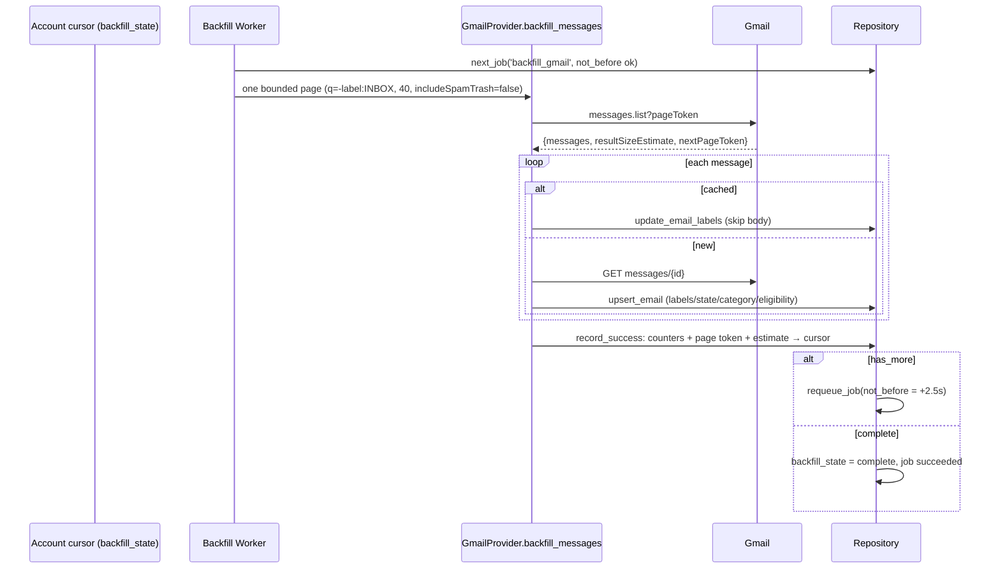

# All Mail Backfill Flow

How the full non-spam/non-trash mailbox arrives locally without hammering Gmail or blocking the product.

## Typed state machine

`backfill_state` in the [[accounts]] sync cursor: `not_started → running → complete` (with `paused` for user pause and `failed` after the retry budget). See [[backend.app.mail.eligibility.BackfillState]] and [[backend.app.mail.backfill]].

## Ownership & resilience

- **Backend owns the loop.** The frontend only observes (`/api/accounts` carries the status payload); closing the UI never pauses sync.
- **One durable job row per account** (`backfill_gmail_<id>`, priority 5 — always below analysis jobs). Each page re-queues the *same* row with `not_before` rate limiting; no job explosion.
- **Failure budget**: transient Gmail errors → `retryable_failed` + exponential backoff (30s → 5m cap) via `not_before`; 401/403 or exhausted attempts → `failed` state.
- **Restart resumes** exactly: startup re-arms the job when state is `not_started`/`running` ([[Application Startup Flow]]). Verified against the real mailbox with zero duplicates.

## Data notes

- The query is `-label:INBOX` — archived + sent arrive; spam/trash never (flag enforced), drafts aren't in `messages.list`.
- `resultSizeEstimate` is captured but treated as approximate (Gmail's number is volatile; UI shows "~N remaining").
- Imported archived/sent rows are **not** enqueued for analysis ([[backend.app.mail.eligibility.MailEligibilityPolicy|MailEligibilityPolicy]]).

## Endpoints

- [[POST --api-accounts-{account_id}-backfill]] — start/resume
- [[POST --api-accounts-{account_id}-backfill-pause]] — pause
- [[GET --api-accounts-{account_id}-backfill]] — observe status

## Tests

- [[backend.tests.test_backfill_jobs.test_backfill_job_is_single_durable_row]]
- [[backend.tests.test_allmail.test_backfill_first_page_and_resume]]
- [[backend.tests.test_backfill_jobs.test_backoff_and_promotion_cycle]]

## Related

- [[Gmail Incremental Sync Flow]]
- [[Pagination]]
- [[backend.app.main._backfill_worker]]
