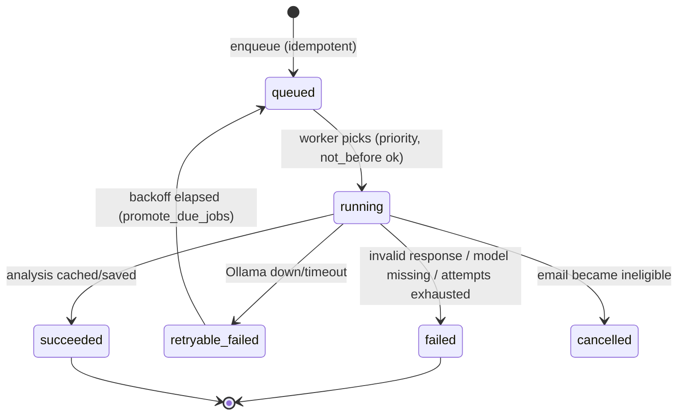

# Background Analysis Job Flow

The durable queue that turns "new email" into "analyzed email" — and survives process death.

## Job model ([[jobs]])

- One row per email: `analyze_<email_id>`, type `analyze_email`, integer priority (higher first), status lifecycle `queued → running → succeeded | retryable_failed → queued | failed | cancelled`.
- `not_before` column enables scheduled re-arms and backoff without busy loops ([[backend.app.db.repositories.Repository.next_job]] ignores rows whose time hasn't come).

## Enqueue sites

- [[POST --api-accounts-{account_id}-sync]] — after each sync, for eligible unanalyzed mail (policy priorities).
- [[POST --api-emails-analyze]] — manual "analyze everything eligible".
- [[POST --api-emails-{email_id}-analyze]] — user-requested single analysis (bypasses cache, still eligibility-gated with 409 for excluded mail).

## Worker loop ([[backend.app.main._analysis_worker]])

1. `next_job` (priority desc) → mark running (attempts++).
2. Re-check eligibility from persisted columns — a message that became spam mid-queue is cancelled, never analyzed.
3. Cache hit → derive tasks from cache, succeed. Miss → [[Email Analysis Flow]].
4. Ollama failures: retryable with backoff; 5 consecutive → pause 30s. Invalid response/model missing → failed.

## Crash safety

- Rows are SQLite — nothing in memory is the queue.
- Startup resets `running → queued` and promotes due retries ([[Application Startup Flow]]).

## Related

- [[Email Analysis Flow]]
- [[All Mail Backfill Flow]] (the sibling worker)
- [[ADR-007 - Background Analysis Queue]]
- [[AI Failure Handling]]
