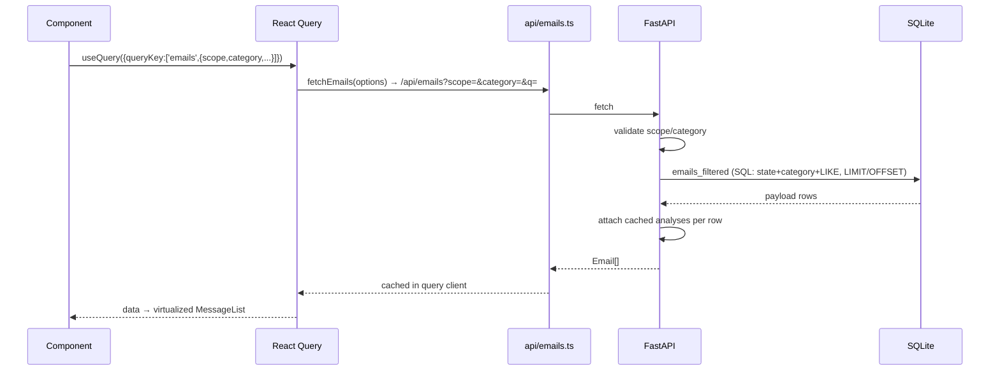

# Frontend Data Fetch Flow

How a screen goes from React component to SQLite and back.

## Query design rules

- **Server-side filtering** — category/scope/search are SQL parameters; the client never filters thousands of rows ([[ADR-012 - Inbox Virtualization]]).
- **Query keys encode the view** — `['emails', {view, kind, category, filter, searchQuery, viewFilter}]` so switching tabs hits the cache; switching category fires one typed request.
- **Stale-while-revalidate** — `staleTime` 10–15s; counts refresh on an interval.
- **Global search ≠ view filter** — header search searches all locally synced mail (`scope=all`), the pane filter scopes the current view ([[frontend.src.layout.WorkspaceHeader.WorkspaceHeader|WorkspaceHeader]], [[frontend.src.mail.MailWorkspace.MailWorkspace|MailWorkspace]]).

## Mutation flows

- Sync/backfill/toggle/delete use `useMutation` with targeted invalidation (`emails`, `emailCounts`, `accounts`, `tasks`, `briefing`).
- SSE events debounce invalidation (1s) to avoid request storms ([[SSE Progress Flow]]).

## Related

- [[API Map]]
- [[ADR-010 - React Query]]
- [[frontend.src.api.emails]]
