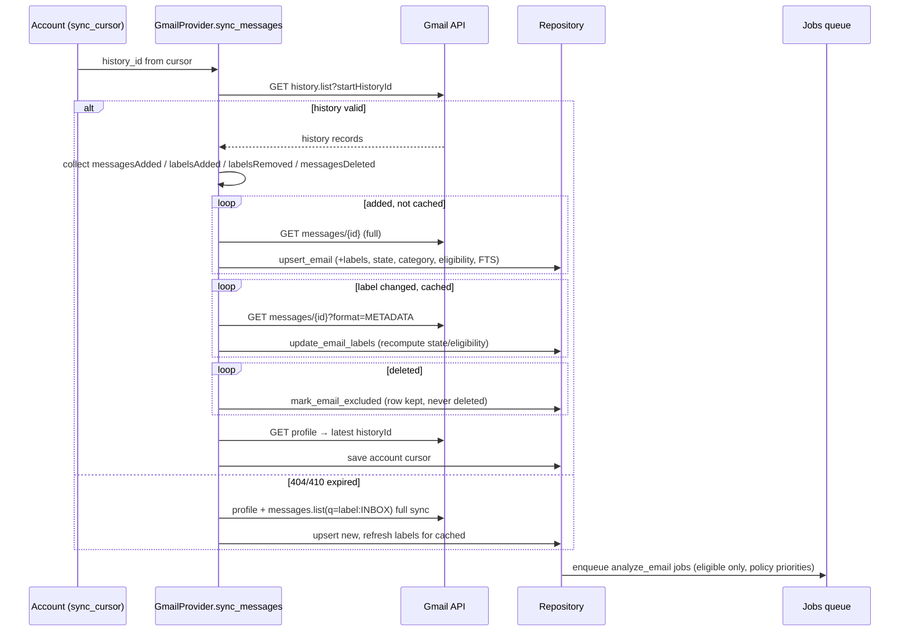

# Gmail Incremental Sync Flow

How the active Inbox stays current, cheaply, across restarts.

## Design points

- **Full sync path** is also the recovery path: `historyId` gone (410) → re-list INBOX with `includeSpamTrash=false` and refresh labels for rows already cached (list responses carry `labelIds`).
- **Label-only changes never re-download bodies** — METADATA format refresh ([[History Sync]]).
- **Deletions are non-destructive**: `messagesDeleted` → `mark_email_excluded`, keeping the source row for thread/history integrity ([[Data Ownership]]).
- **Spam arrivals are skipped** at the provider: history-added messages without INBOX are not cached at all.
- After sync, [[POST --api-accounts-{account_id}-sync|sync_account]] enqueues analysis for eligible mail using [[backend.app.mail.eligibility.MailEligibilityPolicy.analysis_queue_priority|analysis_queue_priority]] — and arms the durable backfill job if it hasn't run yet.

## Verification

- Mock-tested: [[backend.tests.test_gmail_mock.test_gmail_sync_incremental]]
- Label history: [[backend.tests.test_eligibility.test_history_label_changes_refresh_via_metadata]]
- Real-world: exercised against the live mailbox repeatedly ([[Project Status]]).

## Related

- [[History Sync]]
- [[Pagination]]
- [[All Mail Backfill Flow]]
- [[POST --api-accounts-{account_id}-sync]]
