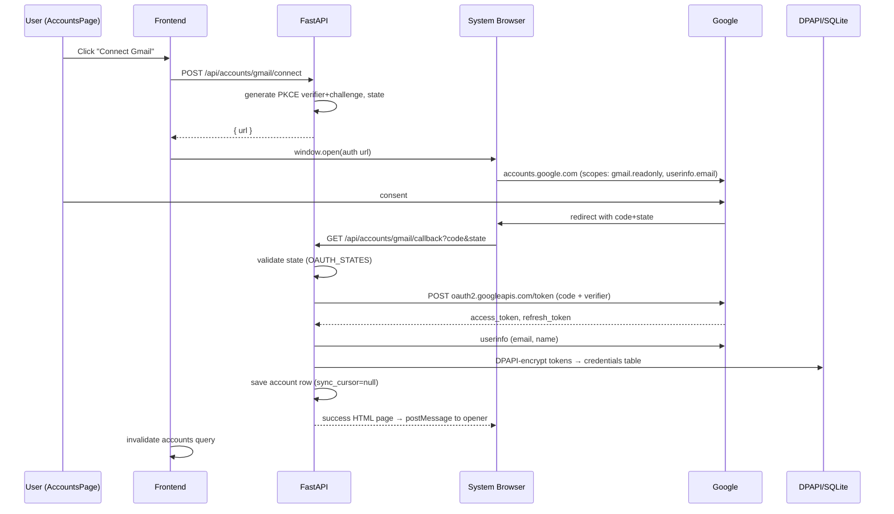

# Gmail OAuth Flow

How Alfred obtains and keeps Gmail credentials, end to end.

## Key mechanics

- **PKCE (S256)** — the popup flow can't keep a client secret safe, so proof-key exchange protects the code: `generate_pkce_pair` in [[backend.app.main]].
- **State validation** — one-time state entries in `OAUTH_STATES` (in-memory); consumed on callback ([[OAuth Security]]).
- **Offline access** — `access_type=offline` + `prompt=consent` so a refresh token is always issued.
- **Scopes** — exactly `userinfo.email` + `gmail.readonly`; sending is impossible by scope design ([[Round 1 Scope]]).
- **Storage** — [[backend.app.db.secure_store.encrypt_token]] → DPAPI ciphertext in [[credentials]]; account id is `gmail_<email>`.

## Handlers

- [[POST --api-accounts-gmail-connect]] → [[POST --api-accounts-gmail-connect|connect_gmail]]
- [[GET --api-accounts-gmail-callback]] → [[GET --api-accounts-gmail-callback|gmail_callback]]
- Provider primitives: [[backend.app.mail.providers.gmail.GmailProvider.get_auth_url]], `exchange_code`, `refresh_tokens`

## Failure modes

- Denied consent → error page ([[backend.app.main._oauth_callback_page|_oauth_callback_page]]), status 400.
- Unknown/expired state → warn log, error page.
- Token exchange failure → stage-tagged warning log; no account row persisted on failure.

## Related

- [[Google OAuth]]
- [[Token Storage]]
- [[OAuth Security]]
- [[backend.tests.test_gmail_mock.test_gmail_oauth_url_generation]]
