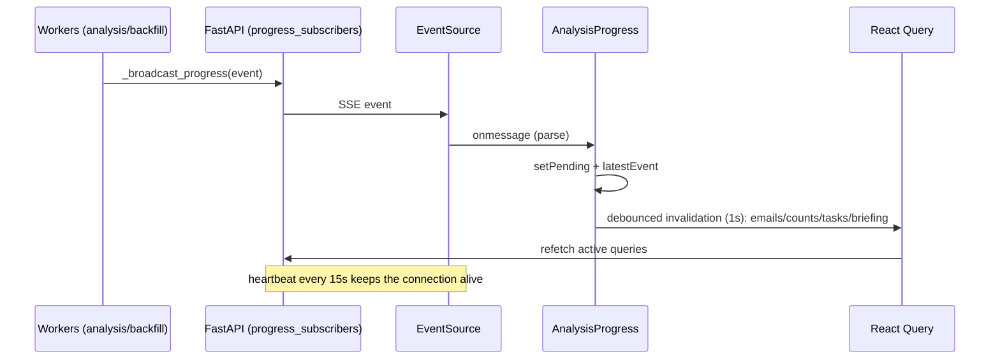

# SSE Progress Flow

How the UI learns that analysis finished — without polling endpoints.

## Event vocabulary

`status`, `analysis_complete` (cached flag + ms), `analysis_error`, `analysis_cancelled`, `worker_paused`, `jobs_enqueued`, `backfill_progress`, `heartbeat`.

## Endpoint & consumer

- [[GET --api-analysis-progress]] — StreamingResponse over in-process queues (`progress_subscribers`); heartbeat keeps proxies from closing.
- [[frontend.src.components.ui.AnalysisProgress.AnalysisProgress|AnalysisProgress]] — renders the floating glass pill ("Analyzing N messages in background…") only while pending > 0; closes the EventSource on unmount.

## Failure posture

SSE drops are safe: the pill disappears, and any completed work is discovered on the next query refresh (React Query's normal cadence). This is why SSE is a *hint*, not the data source — see [[ADR-011 - SSE Progress]].

## Related

- [[Background Analysis Job Flow]]
- [[All Mail Backfill Flow]]
- [[Frontend Data Fetch Flow]]
