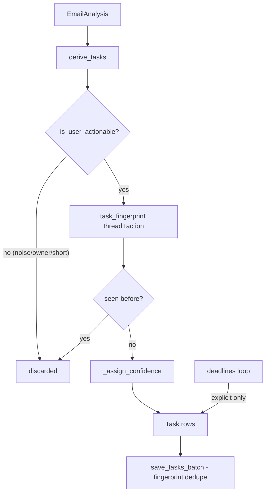

# Task Derivation Flow

How an AI verdict becomes a trustworthy user task — or gets discarded.

## The gates ([[backend.app.services.task_derivation]])

1. **Noise filter** — regex corpus for phishing/CTA patterns ("click here", "verify credentials", payment updates…).
2. **Actionable check** — ≥10 chars, owner is the user (or blank), category is not newsletter/promotion/notification unless high-priority + needs-reply.
3. **Fingerprint** — `sha256(thread_id | normalized action)`; dedupes across emails and across re-derivations.
4. **Confidence** — high (needs-reply ± deadline), medium (high-priority), low otherwise.
5. **Deadline tasks** — only explicit-confidence deadlines become their own tasks.

## Migration & reconciliation ([[backend.app.services.task_migration.TaskMigrationService]])

- Re-derives from cached analyses (no LLM), reconciles by fingerprint: existing tasks keep their id/status/created_at (user state preserved); pending obsolete tasks are removed; completed/dismissed tasks are kept.
- Versioned via `derivation_version` — see [[ADR-009 - Versioned Task Derivation]] and [[backend.app.services.task_derivation.rebuild_tasks_from_analyses|rebuild_tasks_from_analyses]].

## Eligibility boundary

Derivation is guarded by pipeline eligibility: excluded mail (spam/trash/archived/sent) never produces tasks, including during rebuilds ([[backend.app.mail.eligibility.MailEligibilityPolicy|MailEligibilityPolicy]]). Active projections additionally filter by source-email state in [[backend.app.db.repositories.Repository.active_tasks]].

## Tests

- [[backend.tests.test_task_derivation]] — noise, ownership, dedupe, confidence.
- [[backend.tests.test_task_migration]] — idempotency + user-state preservation.
- [[backend.tests.test_eligibility.test_active_tasks_exclude_spam_sourced]]

## Related

- [[Email Analysis Flow]]
- [[ADR-008 - Separate Action Candidates From Tasks]]
- [[Deadline Extraction Flow]]
