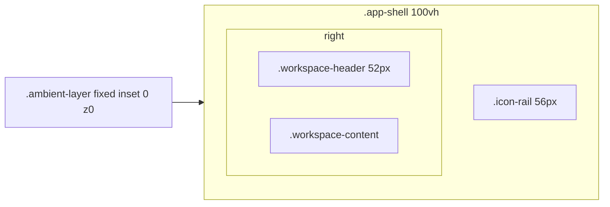

# Application Shell

The fixed outer geometry every screen lives inside.

## Grid

- **Ambient layer** — fixed aurora orbs (violet/indigo/cyan/pink) drifting slowly; pointer-events none; sits *behind* all panes. Dimmed under content (see [[Design System]]).
- **Icon rail** — frosted glass, blur 22px; active state = soft violet block + gradient marker; bottom labelled status icons (Cpu = AI, Mail = Gmail) with tooltips.
- **Header** — frosted, 52px, hairline bottom border; glass search capsule with accent focus glow; Ctrl+K / Esc handled in [[frontend.src.layout.WorkspaceHeader.WorkspaceHeader|WorkspaceHeader]].
- **Content** — pages or the 4-region mail workspace; every region owns its scroll (overscroll-behavior contain prevents chaining).

## Z-scale (tokens)

`--z-ambient: 0 · --z-pane: 10 · --z-header: 25 · --z-rail: 30 · --z-floating: 40 · --z-overlay: 50` (intelligence overlay uses 60 to clear the progress pill).

## Related

- [[Frontend Overview]]
- [[Design System]]
- [[frontend.src.App]]
