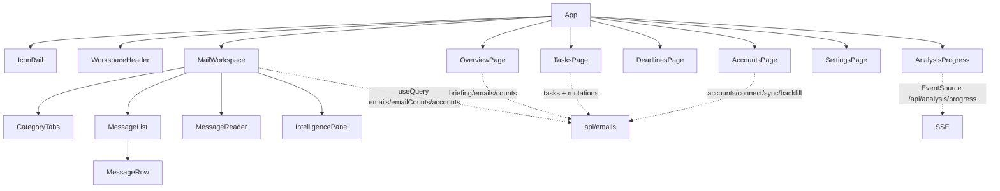

# Frontend Component Map

Composition of the main surface, with data dependencies.

## Component notes

| Component | Responsibility | Notable deps |
|---|---|---|
| [[frontend.src.App.App|App]] | page state, global search routing, sync mutation | all queries |
| [[frontend.src.mail.MailWorkspace.MailWorkspace|MailWorkspace]] | view/kind/category/filter state, Later set, backfill observation | emails, emailCounts, accounts |
| [[frontend.src.mail.MessageList.MessageList|MessageList]] | virtualization (TanStack Virtual) | — |
| [[frontend.src.mail.MessageRow.MessageRow|MessageRow]] | row rendering + Later toggle | localStorage Later set |
| [[frontend.src.mail.MessageReader.MessageReader|MessageReader]] | document reader, Copy/Later/Intel toolbar | emailDetails |
| [[frontend.src.intelligence.IntelligencePanel.IntelligencePanel|IntelligencePanel]] | analysis sections + draft mutation | draft endpoint |
| [[frontend.src.theme.ThemeProvider.ThemeProvider|ThemeProvider]] | theme state, system-preference tracking | themeStore |

## Related

- [[Frontend Overview]]
- [[API Map]]
- [[Dependency Map]]
