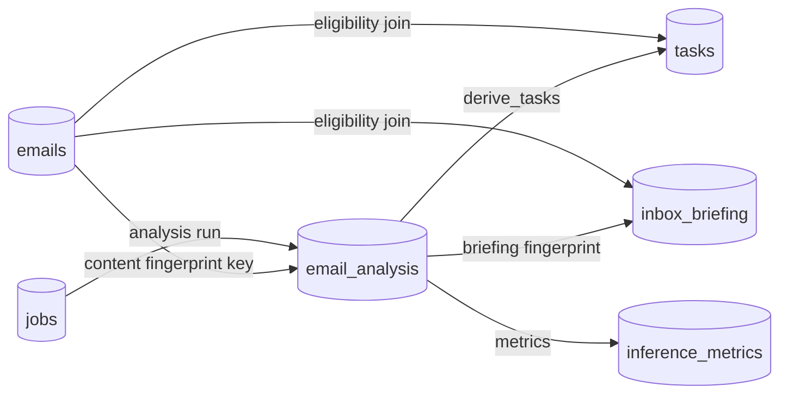

# Derived Data

Everything Alfred computes from [[emails]], and why each piece is safe to recompute.

## Derivation graph

## Recompute rules

- **email_analysis**: keyed by content fingerprint — any email change invalidates; deleting/regenerating loses nothing.
- **tasks**: fingerprints make re-derivation idempotent; versioned (`derivation_version`) so rule changes can rebuild the projection without touching user statuses ([[Task Derivation Flow]]).
- **inbox_briefing**: fingerprint over eligible analyses; regenerate on demand.
- **eligibility columns** (in [[emails]]): derived from label IDs at write and recomputed on every label history event — derived columns living beside source data, kept consistent by one write path.

## What derived data must never do

- Override user state (task status survives migration).
- Outlive its source silently: stale analyses of spam mail are hidden by projections, not served ([[Data Ownership]]).

## Related

- [[Data Ownership]]
- [[AI Caching]]
- [[Migrations]]
