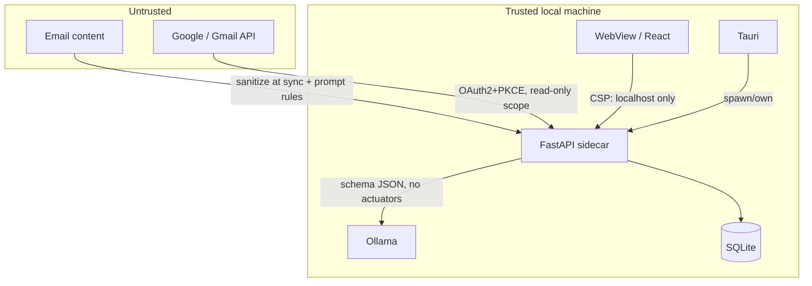

# Trust Boundaries

The explicit lines between trust domains, with what crosses each.

## The rules per boundary

1. **Email → code**: content is data, never markup or instructions ([[Email Content Trust Boundary]]).
2. **Google → Alfred**: tokens in DPAPI, scopes minimal, state one-time ([[OAuth Security]]).
3. **Alfred → Ollama**: loopback; schema-constrained output; no tool/function-calling surface.
4. **WebView → backend**: CORS allowlist (`localhost:5173`, `tauri://localhost`), CSP connect-src ([[Local API Security]], [[Native Security]]).
5. **Backend → SQLite**: single process, single repository class ([[Database Architecture]]).

## Related

- [[Threat Model]]
- [[Security Architecture]]
