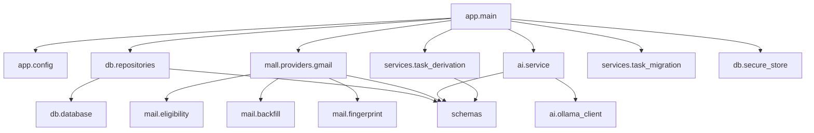

# Backend Code Map

Human-readable map of the backend source tree (`backend/`).

## File-by-file

| Path | What lives there |
|---|---|
| `app/main.py` | All routes, SSE hub, `_analysis_worker`, `_backfill_worker`, lifespan, OAuth helpers, `_derive_and_save_tasks`, `_briefing_eligible_emails` |
| `app/config.py` | `Settings` (env → pydantic) |
| `app/schemas.py` | All Pydantic contracts incl. AI schemas |
| `db/database.py` | `SCHEMA`, `INDEXES`, `FTS_SCHEMA`, `connect`, `_migrate`, `transaction` |
| `db/repositories.py` | `Repository`: every SQL statement |
| `db/secure_store.py` | DPAPI `encrypt_token`/`decrypt_token` |
| `mail/eligibility.py` | Labels, states, categories, `MailEligibilityPolicy` |
| `mail/backfill.py` | Typed backfill cursor model |
| `mail/fingerprint.py` / `briefing_fingerprint.py` | Cache keys |
| `mail/normalizer.py` | Legacy CSV normalization |
| `mail/providers/gmail.py` | `GmailProvider` |
| `ai/ollama_client.py` | `OllamaClient` + error classes + `InferenceMetrics` |
| `ai/service.py` | `AIService`: prompts, sanitization, count overrides |
| `services/task_derivation.py` | Derivation gates, fingerprints, rebuild |
| `services/task_migration.py` | `TaskMigrationService` reconciliation |

## Related

- [[Backend Overview]]
- [[Entry Points]]
- [[Dependency Map]]
