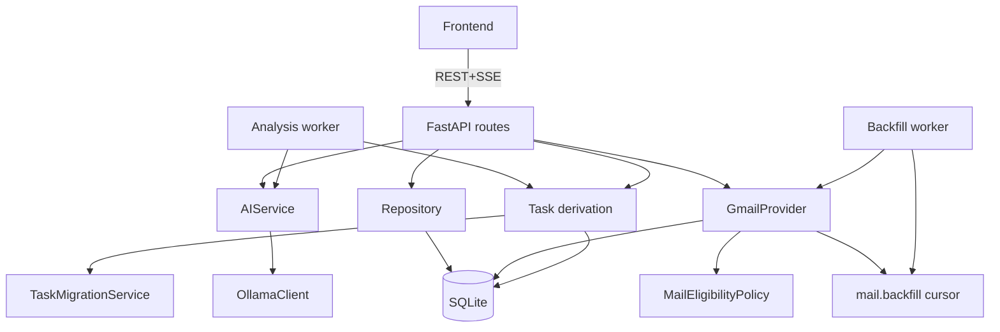

# Dependency Map

Who depends on whom, at the subsystem level — the machine-readable version lives in `99 - Generated/dependency-graph.json`.

## Dependency rules worth knowing

- `schemas` is depended on by everything, depends on nothing.
- `eligibility` is depended on by provider + repository + main; it depends on nothing but its own constants.
- Only `gmail.py` knows Gmail's wire format; only `repositories.py` knows SQL.
- The frontend depends only on the HTTP/SSE surface — never on tables or internals.

## Related

- [[Backend Code Map]]
- [[Frontend Code Map]]
- [[Critical Execution Paths]]
